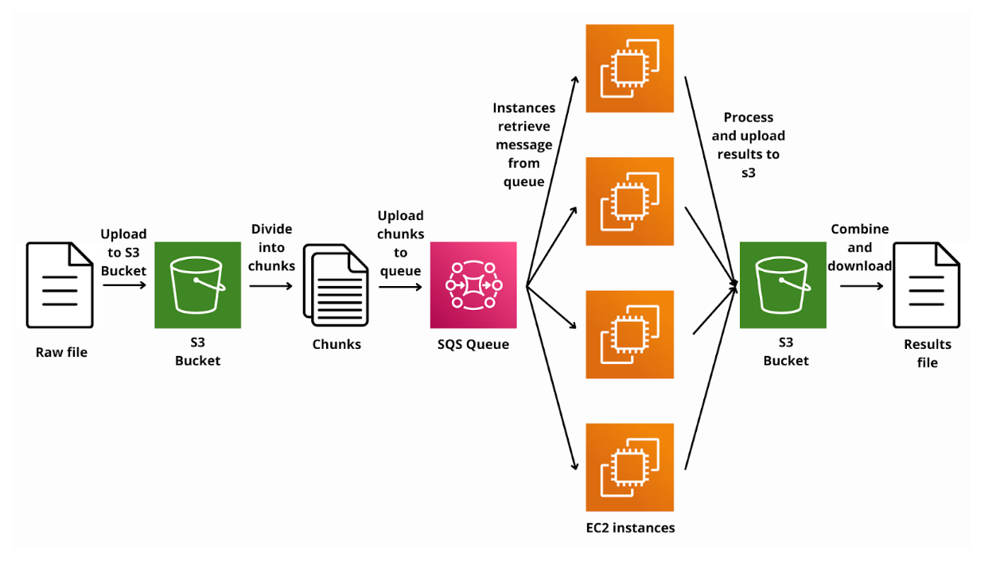
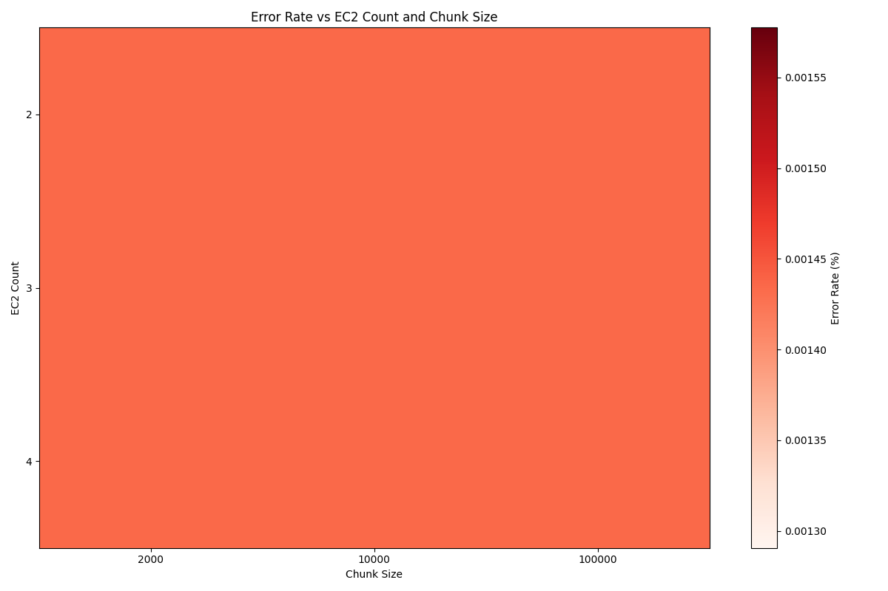
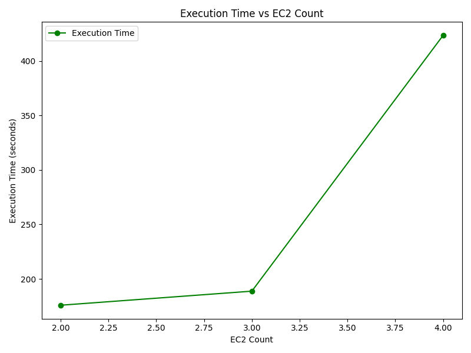
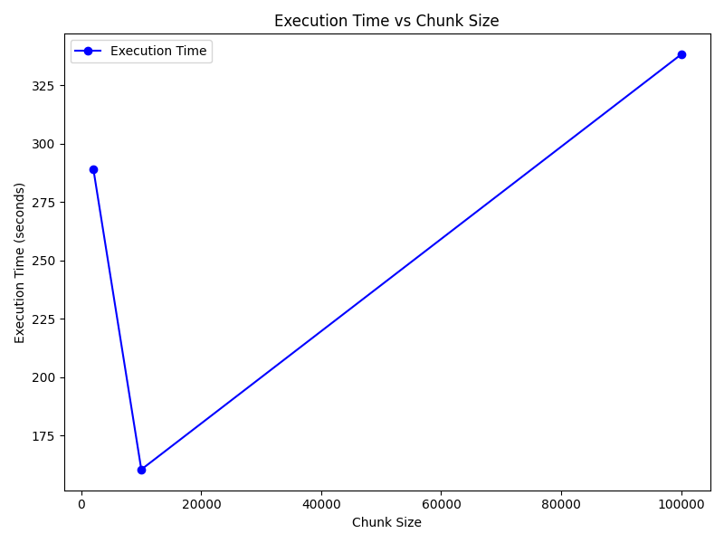

# Parallel word count application implemented using AWS resources

This project is part an implementation of a parallel word count application using AWS resources. 
The architecture is based on the Extract-Load-Transform (ELT) scheme, and is supposed to process
The Complete Work of William Shakespeare. 

The aim of this project is to compare different architectures to handle a huge amount of data
using AWS services. A total of 9 configurations are tested in the [Results](#results) section. 

## Table of content 

- [Get started](#get-started)
  - [Versions](#versions)
  - [Running the files](#running-the-files)
- [Methodology](#methodology)
  - [Process flow](#process-flow)
  - [Configurations](#configurations)
- [Results](#results)

## Get started

### Versions

To run this project, the platform used is the AWS academy, which restrict some functionalities
as it is a learning platform. For example, it is not possible to manage the roles in the
IAM service. 

The python version used is 3.11.0. 

The libraries that need to be installed are gathered in the [requirements.txt](requirements.txt)
file. 

### Running the files

The [main](main.py) file calls the functions to create the resources needed to 
execute the experiment. However, some lines are commented (see below). 
Avoid uncommenting those lines to avoid blocking the AWS academy account.

``` python
# Create and launch EC2 instances
instance_ids = create_ec2_instances(ec2_client, 4)
```

## Methodology

### Process flow

The overall architecture of the process is gathered in the figure below. 
The raw file is first uploaded into a S3 bucket



### Configurations

A total of 9 configurations are assessed. The number of EC2 instances and 
the chunk sizes are the parameters which are modified. 
The number of EC2 instances is between 2 and 4 (the AWS academy limits the 
number of instances to 4 for a unique account).
The chunk size is either: 2000, 10000 or 100000 words per chunk. 

### Datalake structure

The datalake structure is as follows. 

```
datalake/
├── original_document/
├── chunks/
│   ├── chunk_size_1/
│   ├── chunk_size_2/
│   └── chunk_size_3/
├── results/
└── final_results/
```

### Metrics

The configurations are assessed using 2 criteria: the execution time and 
the accuracy of solution. The results of each configuration are gathered in the 
[Results](#results) section.

## Results

A [plotting](lib/plotting.py) file has been created to produce some plot of the 
different configurations' performance.

The error rate has been assessed in the following plot. It reveals that every 
configuration has the same error rate. Changing configurations doesn't impact 
the accuracy of the answer. 



The execution time has been assessed for each number of instances or chunk size 
(results available in the following plots). 




The following plot summarizes the execution time for each configuration. 

